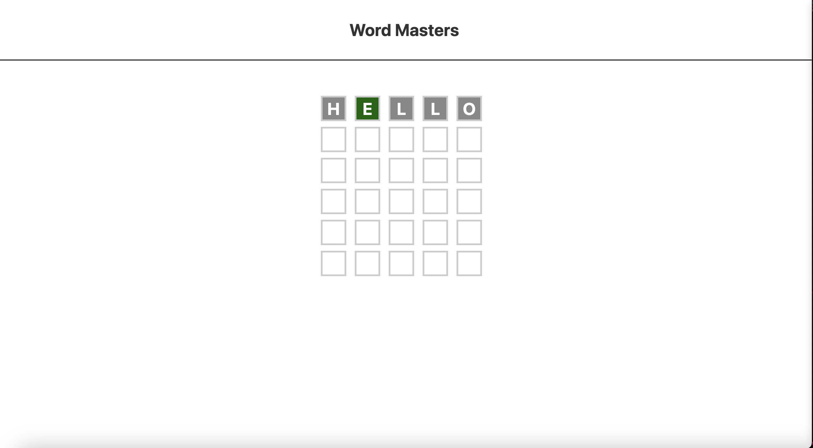

# Word Masters

A fun and interactive word puzzle game built with HTML, CSS, and JavaScript. Word Masters challenges players to guess the correct word by providing feedback on their guesses, making it an engaging and educational experience.

## Features

- **Dynamic Scoreboard**: Displays player guesses in real-time with visual feedback.
- **Interactive Gameplay**: Players can input guesses and receive hints to improve their next attempt.
- **Responsive Design**: Optimized for both desktop and mobile devices.
- **Customizable Word List**: Easily update the game with new words for endless replayability.
- **Minimalist UI**: Clean and intuitive interface for a seamless user experience.

## Technologies Used

- HTML
- CSS
- JavaScript

## How to Play

- Clone the repository.
- Open `index.html` in your browser.
- Start guessing words and use the feedback to find the correct answer.
- Customize the word list by editing the JavaScript file for new challenges.
